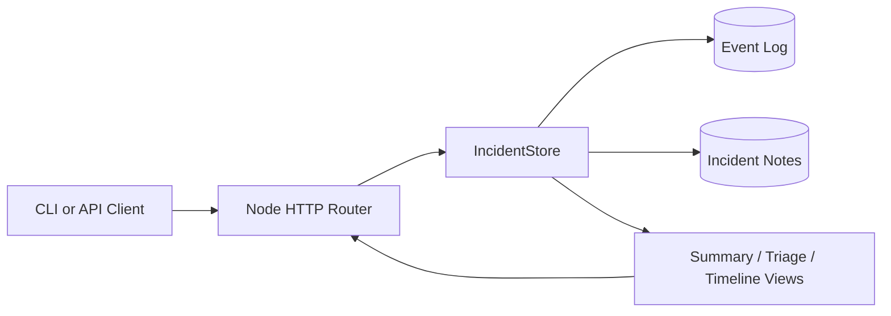

# Incident Hub API

TypeScript incident-management service for reliability teams. It models the operations side of incident handling: idempotent creation, status transitions, notes, timelines, triage ranking, and summary views.

## Why This Exists

This repo is meant to read like a real internal platform service, not a CRUD demo. The design favors deterministic behavior, explicit lifecycle transitions, and reviewable operational artifacts.

## Architecture



1. HTTP handlers validate input and translate requests into domain calls.
1. `IncidentStore` owns incidents, notes, event history, and operational views.
1. Timeline and triage endpoints are derived from stored state instead of separate persistence layers.

## What This Demonstrates

- idempotent writes with repeat request protection
- filterable list and summary endpoints for operational views
- note-taking and event history for auditability
- triage ranking so on-call can prioritize active work
- deterministic tests over API behavior
- a benchmark script that stresses the in-memory service path

## Endpoints

- `GET /health`
- `GET /incidents`
- `GET /incidents/summary`
- `GET /incidents/triage`
- `POST /incidents`
- `POST /incidents/bulk`
- `POST /incidents/:id/notes`
- `GET /incidents/:id/timeline`
- `PATCH /incidents/:id/ack`
- `PATCH /incidents/:id/resolve`

## Run It

```bash
npm test
npm run build
npm run benchmark
npm start
```

## Operational Tradeoffs

- The store is in-memory, which keeps the repo self-contained and testable, but it is not durable.
- Event history lives alongside the current state to keep the design understandable without a database layer.
- The benchmark is synthetic, but it helps quantify the request path and exercise the API in a repeatable way.
- The service intentionally avoids framework dependencies so the domain logic is easy to audit and extend.

## Verification

Run `npm test` for API behavior, `npm run build` for compile health, and `npm run benchmark` to exercise the service under a repeatable in-memory load.
